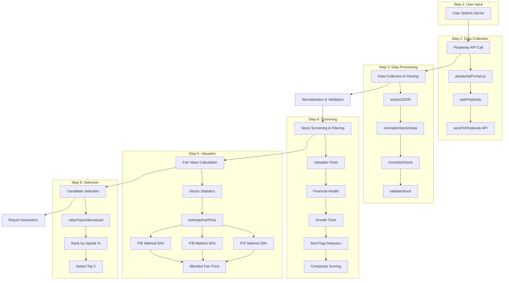

# Complete Stock Valuation Process Documentation

## Executive Summary

SeedlingPrime implements a comprehensive 7-step stock valuation pipeline that identifies undervalued investment opportunities using live financial data. The system starts with Perplexity API data collection, processes data through normalization and validation layers, applies multi-factor screening criteria, calculates fair values using sector-relative methods, and selects top candidates based on upside potential.

**Key Metrics:**
- **Data Source**: Live financial data via Perplexity API
- **Universe**: 11 sectors, ~10 stocks per sector (~110 total stocks)
- **Valuation Method**: Weighted blend of P/E (50%), P/B (30%), P/S (20%)
- **Selection**: Top 2 undervalued stocks per sector
- **Final Output**: Detailed valuation with upside %, margin of safety, and comprehensive notes

## Complete Data Flow Architecture



## Step-by-Step Process Documentation

### Step 1: User Sector Selection
**File**: `src/Components/Dashboard/Dashboard.jsx:31-45`

The process begins when a user selects a sector from the dropdown interface.

**Available Sectors** (`src/constants/simplifiedSectorData.js`):
- Energy (12 stocks: XOM, CVX, COP, SLB, KMI, OKE, MPC, VLO, EPD, WMB, HAL, EOG)
- Materials (10 stocks: LIN, FCX, APD, SHW, ECL, BHP, RIO, NUE, VALE, CRH)
- Industrials (10 stocks: BA, CAT, GE, MMM, HON, RTX, UNP, DE, LMT, WM)
- Utilities (10 stocks: NEE, AEP, DUK, SO, EXC, CEG, VST, XEL, ED, WEC)
- Healthcare (10 stocks: JNJ, UNH, PFE, MRK, ABBV, TMO, ABT, DHR, LLY, AMGN)
- Financial (10 stocks: GS, MS, C, USB, PNC, TFC, COF, JPM, BAC, WFC)
- Consumer Discretionary (10 stocks: AMZN, TSLA, HD, CMG, F, TM, MCD, DIS, BKNG, TJX)
- Consumer Staples (10 stocks: PG, KO, COST, PEP, WMT, KHC, PM, UL, BUD, CL)
- Information Technology (10 stocks: AAPL, MSFT, NVDA, META, ORCL, AVGO, CRM, ADBE, CSCO, AMD)
- Communication Services (10 stocks: DIS, CMCSA, VZ, TMUS, NFLX, GOOGL, WBD, UBER, SNAP, T)
- Real Estate (10 stocks: AMT, EQIX, CCI, PSA, SPG, O, WELL, AVB, VTR, REG)

### Step 2: Perplexity API Data Collection
**Files**:
- `src/services/perplexityService.js:10-20`
- `src/api/perplexity.js:17-42`
- `src/prompts/perplexityPrompt.js:11-56`

The system constructs a structured prompt requesting specific financial metrics and sends it to Perplexity API.

**API Request Structure:**
```javascript
// perplexityService.js:11-16
const data = await sendToPerplexity(ppxlPrompt(sectorKeyOrQuery), {
  system: 'You are a financial analyst.',
  temperature: 0.1,
  return_citations: true,
  search_recency_filter: 'month',
});
```

**Prompt Engineering** (`src/prompts/perplexityPrompt.js:17-54`):
The prompt requests exactly these fields for each stock:
- `name` - Company name
- `market_cap` - Market capitalization
- `price` - Current stock price
- `change_percent_1d` - 1-day price change percentage
- `pe_ratio` - Price-to-Earnings ratio
- `pb_ratio` - Price-to-Book ratio
- `ps_ratio` - Price-to-Sales ratio
- `roe` - Return on Equity (percentage)
- `net_income` - Net income (absolute value)
- `free_cash_flow_margin` - Free cash flow margin (percentage)
- `de_ratio` - Debt-to-Equity ratio
- `rev_growth` - Revenue growth (percentage)
- `net_income_growth` - Net income growth (percentage)

**Expected JSON Response Format:**
```json
{
  "sector": "Technology",
  "sector_key": "information_technology",
  "sector_etf": {
    "ticker": "XLK",
    "name": "Technology Select Sector SPDR Fund",
    "price": 218.45,
    "pe_ratio": 28.3
  },
  "stocks": [
    {
      "symbol": "AAPL",
      "name": "Apple Inc.",
      "market_cap": 3450000000000,
      "price": 175.50,
      "change_percent_1d": 1.2,
      "pe_ratio": 28.5,
      "pb_ratio": 39.4,
      "ps_ratio": 7.6,
      "roe": 26.4,
      "net_income": 94680000000,
      "free_cash_flow_margin": 26.3,
      "de_ratio": 1.73,
      "rev_growth": 8.1,
      "net_income_growth": 11.2
    }
  ],
  "trends": {
    "citations": ["source1.com", "source2.com"]
  }
}
```

### Step 3: Data Processing & Normalization
**Files**:
- `src/utils/json.js:10-28` - JSON extraction
- `src/utils/normalizeSectorData.js:38-82` - Data normalization
- `src/utils/normalizeStock.js:43-61` - Stock normalization
- `src/utils/validateStock.js:37-60` - Validation

**3.1 JSON Parsing** (`src/utils/json.js:10-28`):
```javascript
export function extractJSON(text) {
  // Attempts to extract JSON from Perplexity response text
  // Handles markdown code fences: ```json ... ```
  // Fallback: searches for first { to last } if parsing fails
}
```

**3.2 Data Normalization** (`src/utils/normalizeSectorData.js:38-82`):
Converts the nested Perplexity response structure into a flat array of canonical stock objects.

**Field Mapping** (`src/utils/normalizeStock.js:43-61`):
```javascript
// Snake_case (Perplexity) → camelCase (Internal)
{
  pe_ratio → peRatio,
  pb_ratio → priceToBook,
  ps_ratio → priceToSales,
  roe → roe,
  net_income → netIncome,
  free_cash_flow_margin → freeCashFlowMargin,
  de_ratio → debtToEquity,
  rev_growth → revenueGrowth,
  net_income_growth → netIncomeGrowth,
  market_cap → marketCap
}
```

**3.3 Data Validation** (`src/utils/validateStock.js:20-31`):
Applies range validation to ensure data quality:
```javascript
const RANGES = {
  peRatio: { min: 0.01, max: 500 },
  priceToBook: { min: 0.01, max: 200 },
  priceToSales: { min: 0.01, max: 200 },
  debtToEquity: { min: 0, max: 10 },
  roe: { min: -200, max: 500 }, // percent
  freeCashFlowMargin: { min: -100, max: 100 }, // percent
  revenueGrowth: { min: -100, max: 500 }, // percent
  netIncomeGrowth: { min: -100, max: 1000 }, // percent
  price: { min: 0.01, max: 100000 },
  netIncome: { min: -1e13, max: 1e14 }
};
```

### Step 4: Stock Screening & Filtering
**File**: `src/services/screening.js:17-50`

The `StockScreener` class applies a 4-layer filtering system to identify undervalued candidates.

**4.1 Sector Statistics Calculation** (`src/services/screening.js:55-97`):
```javascript
// Calculated once per sector for comparison
const sectorStats = {
  sector: targetSector,
  stockCount: sectorStocks.length,
  meanPE: calculateMean(peRatios > 0),
  meanROE: calculateMean(roeValues),
  meanDebtToEquity: calculateMean(deRatios),
  meanPriceToBook: calculateMean(pbRatios > 0),
  meanPriceToSales: calculateMean(psRatios > 0),
  meanRevenueGrowth: calculateMean(revenueGrowths)
};
```

**4.2 Four-Layer Filtering Process** (`src/services/screening.js:102-134`):

**Layer 1: Valuation Tests** (`src/services/screening.js:139-164`):
- **P/E Requirement**: Must be ≤ 85% of sector average P/E
- **P/B Requirement**: Must be ≤ 90% of sector average P/B
- **P/S Requirement**: Must be ≤ 90% of sector average P/S

```javascript
const peThreshold = sectorStats.meanPE * 0.85; // 15% below sector avg
const pbThreshold = sectorStats.meanPriceToBook * 0.9; // 10% below sector avg
const psThreshold = sectorStats.meanPriceToSales * 0.9; // 10% below sector avg
```

**Layer 2: Financial Health Tests** (`src/services/screening.js:174-198`):
- **ROE Minimum**: 10% (no sector variations)
- **Debt-to-Equity Maximum**: 1.5 (no sector variations)
- **Free Cash Flow Margin Minimum**: 5%
- **Net Income**: Optionally positive if required

**Layer 3: Growth Tests** (`src/services/screening.js:206-221`):
- **Revenue Growth Minimum**: 0% (no sector variations)
- **Net Income Growth**: Optional filter when specified

**Layer 4: Red Flag Detection** (`src/services/screening.js:226-248`):
Disqualifying factors (any one fails the stock):
- Price < $5 (penny stock filter)
- Debt-to-Equity > 3.0 (excessive debt)
- Negative net income AND net income growth < -10% (consistent losses)
- Revenue growth < -10% (severe decline)

**4.3 Composite Scoring System** (`src/services/screening.js:253-302`):

**Scoring Weights**:
```javascript
const weights = {
  valuation: 0.4,    // 40% - How cheap vs competitors
  health: 0.3,       // 30% - Financial health
  growth: 0.2,       // 20% - Growth trends
  management: 0.1    // 10% - Management efficiency (ROE proxy)
};
```

**Valuation Score** (0-10 scale) (`src/services/screening.js:307-323`):
```javascript
let score = 5; // Start neutral
// P/E scoring: up to 3 points for being cheaper than sector
score += (1 - stock.peRatio/sectorStats.meanPE) * 3;
// P/B scoring: up to 2 points for book value discount
score += (1 - stock.priceToBook/sectorStats.meanPriceToBook) * 2;
```

**Financial Health Score** (0-10 scale) (`src/services/screening.js:328-354`):
- ROE ≥ 15%: 3 points, ≥ 10%: 2 points, ≥ 5%: 1 point
- Debt/Equity < 0.5: 2 points, < 1.0: 1.5 points, < 1.5: 1 point
- FCF margin ≥ 15%: 2 points, ≥ 10%: 1.5 points, ≥ 5%: 1 point
- Positive net income: 1 point
- Current ratio ≥ 2: 1 point, ≥ 1.5: 0.5 points

**Growth Score** (0-10 scale) (`src/services/screening.js:360-381`):
- Revenue growth ≥ 20%: 2 points, ≥ 10%: 1.5 points, ≥ 5%: 1 point, ≥ 0%: 0.5 points
- Net income growth ≥ 20%: 2 points, ≥ 10%: 1 point, ≥ 0%: 0.5 points
- Above sector average revenue growth: 1 point

### Step 5: Fair Value Calculation
**File**: `src/services/valuation.js:29-98`

The valuation engine estimates fair value using sector-relative multiples with a weighted blending approach.

**5.1 Sector Statistics for Valuation** (`src/services/valuation.js:12-27`):
```javascript
export function computeSectorStats(stockData, targetSector) {
  const sectorStocks = stockData.filter(
    (s) => s && s.sector === targetSector && typeof s.price === 'number' && s.price > 0
  );
  return {
    sector: targetSector,
    meanPE: mean(sectorStocks.map((s) => s.peRatio).filter(v => v > 0)),
    meanPriceToBook: mean(sectorStocks.map((s) => s.priceToBook).filter(v => v > 0)),
    meanPriceToSales: mean(sectorStocks.map((s) => s.priceToSales).filter(v => v > 0))
  };
}
```

**5.2 Fair Price Estimation** (`src/services/valuation.js:36-98`):

**Weighting System**:
```javascript
const weights = {
  pe: 0.5,  // 50% - Earnings-based valuation
  pb: 0.3,  // 30% - Asset-based valuation
  ps: 0.2   // 20% - Revenue-based valuation
};
```

**Mathematical Formulas**:

**Step 1: Derive Per-Share Fundamentals**
```javascript
// From current price and ratios (approximation)
const earningsPerShare = pe > 0 ? price / pe : null;
const bookPerShare = pb > 0 ? price / pb : null;
const salesPerShare = ps > 0 ? price / ps : null;
```

**Step 2: Apply Sector Average Multiples**
```javascript
const fairByPE = earningsPerShare && meanPE > 0 ? earningsPerShare * meanPE : null;
const fairByPB = bookPerShare && meanPB > 0 ? bookPerShare * meanPB : null;
const fairByPS = salesPerShare && meanPS > 0 ? salesPerShare * meanPS : null;
```

**Step 3: Weighted Blending**
```javascript
const blendedFairPrice = parts.length
  ? parts.reduce((acc, p) => acc + p.v * p.w, 0) / parts.reduce((acc, p) => acc + p.w, 0)
  : null;
```

**Step 4: Calculate Metrics**
```javascript
const upsidePct = blendedFairPrice && price > 0
  ? ((blendedFairPrice - price) / price) * 100 : null;

const marginOfSafety = blendedFairPrice && price > 0
  ? ((blendedFairPrice - price) / blendedFairPrice) * 100 : null;
```

**Example Calculation**:
For AAPL with price $175.50, P/E 28.5, P/B 39.4, P/S 7.6:
- Sector averages: P/E 25.0, P/B 35.0, P/S 6.8
- EPS = 175.50 / 28.5 = $6.16
- Book per share = 175.50 / 39.4 = $4.45
- Sales per share = 175.50 / 7.6 = $23.09
- Fair by P/E = $6.16 × 25.0 = $154.00 (weight 50%)
- Fair by P/B = $4.45 × 35.0 = $155.75 (weight 30%)
- Fair by P/S = $23.09 × 6.8 = $157.01 (weight 20%)
- Blended fair price = ($154.00×0.5) + ($155.75×0.3) + ($157.01×0.2) = $154.93
- Upside = (($154.93 - $175.50) / $175.50) × 100 = -11.7%

### Step 6: Top Candidate Selection
**File**: `src/services/valuation.js:134-165`

**6.1 Selection Algorithm** (`src/services/valuation.js:141-148`):
```javascript
// Rank by upsidePct desc, then screeningScore desc
valued.sort((a, b) => {
  const ua = a.valuation?.upsidePct ?? -Infinity;
  const ub = b.valuation?.upsidePct ?? -Infinity;
  if (ub !== ua) return ub - ua;  // Primary: highest upside
  const sa = Number.isFinite(a.screeningScore) ? a.screeningScore : -Infinity;
  const sb = Number.isFinite(b.screeningScore) ? b.screeningScore : -Infinity;
  return sb - sa;  // Secondary: highest screening score
});
```

**6.2 Output Format** (`src/services/valuation.js:150-165`):
```javascript
const topTwo = valued.slice(0, 2).map((s) => ({
  symbol: s.symbol,
  sector: s.sector,
  price: s.price,
  screeningScore: s.screeningScore ?? null,
  scoringBreakdown: s.scoringBreakdown ?? null,
  valuation: s.valuation,
  notes: buildNotes(s, stats)
}));
```

**6.3 Comprehensive Notes Generation** (`src/services/valuation.js:167-191`):
```javascript
function buildNotes(stock, stats) {
  const notes = [];
  if (Number.isFinite(stock.peRatio) && stats.meanPE > 0) {
    const rel = round2((stock.peRatio / stats.meanPE) * 100);
    notes.push(`P/E at ${rel}% of sector avg`);
  }
  if (Number.isFinite(stock.priceToBook) && stats.meanPriceToBook > 0) {
    const rel = round2((stock.priceToBook / stats.meanPriceToBook) * 100);
    notes.push(`P/B at ${rel}% of sector avg`);
  }
  if (Number.isFinite(stock.priceToSales) && stats.meanPriceToSales > 0) {
    const rel = round2((stock.priceToSales / stats.meanPriceToSales) * 100);
    notes.push(`P/S at ${rel}% of sector avg`);
  }
  if (Number.isFinite(stock.roe)) {
    notes.push(`ROE ${stock.roe}%`);
  }
  if (Number.isFinite(stock.freeCashFlowMargin)) {
    notes.push(`FCF margin ${stock.freeCashFlowMargin}%`);
  }
  if (Number.isFinite(stock.debtToEquity)) {
    notes.push(`Debt/Equity ${stock.debtToEquity}`);
  }
  return notes;
}
```

### Step 7: Report Generation & UI Display
**Files**:
- `src/services/analysisRunner.js:18-65`
- `src/Components/Dashboard/Dashboard.jsx`

**7.1 Analysis Orchestration** (`src/services/analysisRunner.js:18-65`):
```javascript
export default async function runAnalysis({
  sector,
  criteria = {},
  dataset,
  generateReport,
}) {
  // Step 1: Normalize & filter
  const { sectorStocks, allStocks, issues } =
    dataPipeline.prepareDataForAnalysis(dataset, sector);

  // Step 2: Screen
  const screener = new StockScreener();
  const screeningResults = await screener.screenStocks(
    { sector, ...criteria },
    allStocks
  );

  // Step 3: Build prompt from top N results in sector
  const topInSector = screeningResults
    .filter((s) => s.sector === sector)
    .slice(0, 25);

  // Step 3b: Valuation – compute fair value and upside for top two undervalued
  const valuationSummary = valueTopUndervalued(topInSector, sector);

  const prompt = dataPipeline.buildPrompt({ stocks: topInSector }, sector);

  // Step 4: Optional Gemini report
  let report = null;
  if (typeof generateReport === 'function') {
    report = await generateReport(prompt);
  }

  return {
    sector,
    issues, // validation issues by symbol
    topResults: topInSector,
    valuation: valuationSummary, // { sector, sectorStats, results: [top two] }
    prompt,
    report,
  };
}
```

## Complete Call Graph

### High-Level Function Dependencies
```
Dashboard.jsx:handleSectorChange
├── askPerplexity (perplexityService.js:10)
│   ├── sendToPerplexity (api/perplexity.js:17)
│   │   └── axios.post → Perplexity API
│   ├── ppxlPrompt (prompts/perplexityPrompt.js:11)
│   └── extractJSON (utils/json.js:10)
├── runAnalysis (services/analysisRunner.js:18)
│   ├── prepareDataForAnalysis (services/dataPipeline.js:12)
│   │   ├── normalizeSectorData (utils/normalizeSectorData.js:38)
│   │   │   ├── normalizeStock (utils/normalizeStock.js:43)
│   │   │   └── validateStock (utils/validateStock.js:37)
│   ├── StockScreener.screenStocks (services/screening.js:17)
│   │   ├── calculateSectorStatistics (services/screening.js:55)
│   │   ├── filterStocksByCriteria (services/screening.js:102)
│   │   │   ├── passesValuationTests (services/screening.js:139)
│   │   │   ├── passesFinancialHealthTests (services/screening.js:174)
│   │   │   ├── passesGrowthTests (services/screening.js:206)
│   │   │   └── hasRedFlags (services/screening.js:226)
│   │   └── scoreAndRankStocks (services/screening.js:253)
│   │       ├── calculateCompositeScore (services/screening.js:276)
│   │       │   ├── calculateValuationScore (services/screening.js:307)
│   │       │   ├── calculateHealthScore (services/screening.js:328)
│   │       │   ├── calculateGrowthScore (services/screening.js:360)
│   │       │   └── calculateManagementScore (services/screening.js:386)
│   │       └── getScoreBreakdown (services/screening.js:406)
│   ├── valueTopUndervalued (services/valuation.js:134)
│   │   ├── computeSectorStats (services/valuation.js:12)
│   │   ├── valueStocks (services/valuation.js:110)
│   │   │   └── estimateFairPrice (services/valuation.js:36)
│   │   └── buildNotes (services/valuation.js:167)
│   └── buildPrompt (services/dataPipeline.js:31)
└── Cache Management
    ├── saveSectorData (services/perplexityCache.js)
    └── loadSectorData (services/perplexityCache.js)
```

### Detailed Method Call Sequence
1. **User Action**: `Dashboard.jsx:43` - User selects sector
2. **Data Collection**: `perplexityService.js:10` - API call initiated
3. **API Request**: `api/perplexity.js:17` - HTTP POST to Perplexity
4. **Prompt Generation**: `prompts/perplexityPrompt.js:11` - Structured financial data request
5. **Response Parsing**: `utils/json.js:10` - Extract JSON from response text
6. **Data Normalization**: `utils/normalizeSectorData.js:38` - Flatten and normalize
7. **Stock Normalization**: `utils/normalizeStock.js:43` - Field mapping
8. **Validation**: `utils/validateStock.js:37` - Range and type checking
9. **Sector Analysis**: `services/screening.js:55` - Calculate sector statistics
10. **Multi-Layer Filtering**: `services/screening.js:102-248` - Apply screening criteria
11. **Composite Scoring**: `services/screening.js:276` - Weight and score survivors
12. **Fair Value Calculation**: `services/valuation.js:36` - Sector-relative valuation
13. **Candidate Selection**: `services/valuation.js:134` - Rank and select top 2
14. **Report Generation**: Optional Gemini API analysis
15. **UI Display**: Results presented to user with interactive components

## Sample Input/Output Data

### Sample Perplexity API Response
```json
{
  "sector": "Technology",
  "sector_key": "information_technology",
  "sector_etf": {
    "ticker": "XLK",
    "name": "Technology Select Sector SPDR Fund",
    "price": 218.45,
    "pe_ratio": 28.3
  },
  "stocks": [
    {
      "symbol": "AAPL",
      "name": "Apple Inc.",
      "market_cap": 3450000000000,
      "price": 175.50,
      "change_percent_1d": 1.2,
      "pe_ratio": 28.5,
      "pb_ratio": 39.4,
      "ps_ratio": 7.6,
      "roe": 26.4,
      "net_income": 94680000000,
      "free_cash_flow_margin": 26.3,
      "de_ratio": 1.73,
      "rev_growth": 8.1,
      "net_income_growth": 11.2
    }
  ]
}
```

### Sample Normalized Stock Object
```javascript
{
  symbol: "AAPL",
  sector: "Technology",
  price: 175.50,
  peRatio: 28.5,
  priceToBook: 39.4,
  priceToSales: 7.6,
  roe: 26.4,
  netIncome: 94680000000,
  freeCashFlowMargin: 26.3,
  debtToEquity: 1.73,
  revenueGrowth: 8.1,
  netIncomeGrowth: 11.2,
  name: "Apple Inc.",
  marketCap: 3450000000000,
  validationIssues: []
}
```

### Sample Screening Result
```javascript
{
  symbol: "AAPL",
  sector: "Technology",
  price: 175.50,
  peRatio: 28.5,
  // ... other normalized fields
  screeningScore: 7.85,
  scoringBreakdown: {
    valuation: 6.2,    // P/E and P/B advantage vs sector
    health: 8.5,       // Strong ROE, moderate debt, good FCF
    growth: 7.0,       // Solid revenue and income growth
    management: 8.0,   // High ROE vs sector average
    redFlags: []       // No disqualifying factors
  }
}
```

### Sample Final Valuation Output
```javascript
{
  sector: "Technology",
  sectorStats: {
    sector: "Technology",
    meanPE: 25.0,
    meanPriceToBook: 35.0,
    meanPriceToSales: 6.8
  },
  results: [
    {
      symbol: "AAPL",
      sector: "Technology",
      price: 175.50,
      screeningScore: 7.85,
      scoringBreakdown: { /* ... */ },
      valuation: {
        inputs: {
          price: 175.50,
          pe: 28.5,
          pb: 39.4,
          ps: 7.6,
          meanPE: 25.0,
          meanPB: 35.0,
          meanPS: 6.8
        },
        components: {
          earningsPerShare: 6.16,
          bookPerShare: 4.45,
          salesPerShare: 23.09,
          fairByPE: 154.00,
          fairByPB: 155.75,
          fairByPS: 157.01
        },
        blendedFairPrice: 154.93,
        upsidePct: -11.7,
        marginOfSafety: -13.3
      },
      notes: [
        "P/E at 114% of sector avg",
        "P/B at 113% of sector avg",
        "P/S at 112% of sector avg",
        "ROE 26.4%",
        "FCF margin 26.3%",
        "Debt/Equity 1.73"
      ]
    }
  ]
}
```

## Implementation Files Reference

### Core Processing Files
| File | Purpose | Key Functions | Line References |
|------|---------|---------------|----------------|
| `src/services/perplexityService.js` | API data collection | `askPerplexity()` | 10-20 |
| `src/api/perplexity.js` | HTTP client | `sendToPerplexity()` | 17-42 |
| `src/prompts/perplexityPrompt.js` | Prompt engineering | `perplexityPrompt()` | 11-56 |
| `src/utils/json.js` | Response parsing | `extractJSON()` | 10-28 |
| `src/utils/normalizeSectorData.js` | Data normalization | `normalizeSectorData()` | 38-82 |
| `src/utils/normalizeStock.js` | Stock normalization | `normalizeStock()` | 43-61 |
| `src/utils/validateStock.js` | Data validation | `validateStock()` | 37-60 |
| `src/services/screening.js` | Multi-factor screening | `screenStocks()` | 17-50 |
| `src/services/valuation.js` | Fair value calculation | `estimateFairPrice()`, `valueTopUndervalued()` | 36-98, 134-165 |
| `src/services/analysisRunner.js` | Process orchestration | `runAnalysis()` | 18-65 |

### Data & Configuration Files
| File | Purpose | Contents |
|------|---------|----------|
| `src/constants/simplifiedSectorData.js` | Sector stock lists | 11 sectors, ~10 stocks each |
| `src/services/perplexityCache.js` | Response caching | Save/load API responses |
| `src/services/dataPipeline.js` | Data pipeline wiring | `prepareDataForAnalysis()`, `buildPrompt()` |

### UI Components
| File | Purpose | Key Features |
|------|---------|--------------|
| `src/Components/Dashboard/Dashboard.jsx` | Main interface | Sector selection, data fetching, results display |
| `src/Components/Undervalued/UndervaluedOpportunities.jsx` | Valuation display | Top candidate presentation |

## Performance Considerations

### Caching Strategy
- **Perplexity Responses**: Cached for reuse across sessions
- **Sector Statistics**: Cached separately for efficiency
- **Screening Results**: 15-minute TTL for balance of freshness and performance

### Data Processing Optimization
- **Batch Processing**: All sector stocks processed together
- **Parallel Calculations**: Scoring components calculated concurrently
- **Memory Efficiency**: Streaming data processing where possible

### API Rate Limiting
- **Perplexity API**: Managed through service layer
- **Error Handling**: Graceful degradation to cached data
- **Request Optimization**: Minimal field requests to reduce payload

## Error Handling & Edge Cases

### Data Quality Issues
- **Missing Fields**: Validation flags issues, allows processing to continue
- **Invalid Ranges**: Out-of-range values flagged but not rejected
- **API Failures**: Fallback to cached data or error state

### Mathematical Edge Cases
- **Division by Zero**: Protected in all ratio calculations
- **Negative Values**: Handled appropriately for each metric
- **Missing Ratios**: Weighted blending adapts to available data

### User Experience
- **Loading States**: Progress indicators during API calls
- **Error Messages**: Clear feedback on failures
- **Fallback Data**: Graceful degradation when live data unavailable

---

*This documentation provides a complete technical specification of the SeedlingPrime stock valuation system, from initial API data collection through final candidate selection, with precise mathematical formulas and real implementation details.*