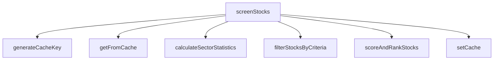
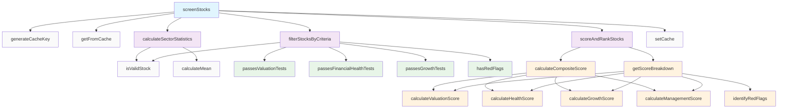

# StockScreener Class Call Graph

This document shows the method call relationships within the StockScreener class, visualizing how methods interact with each other.

## Main Entry Point



## Method Call Hierarchy

### Level 1: Public Interface
- **`screenStocks(criteria, stockData)`** - Main entry point

### Level 2: Core Processing Methods
- **`calculateSectorStatistics(stockData, targetSector)`** - Called by `screenStocks`
- **`filterStocksByCriteria(stockData, criteria, sectorStats)`** - Called by `screenStocks`
- **`scoreAndRankStocks(stocks, criteria, sectorStats)`** - Called by `screenStocks`

### Level 3: Filtering Methods
- **`passesValuationTests(stock, sectorStats, criteria)`** - Called by `filterStocksByCriteria`
- **`passesFinancialHealthTests(stock, criteria)`** - Called by `filterStocksByCriteria`
- **`passesGrowthTests(stock, criteria)`** - Called by `filterStocksByCriteria`
- **`hasRedFlags(stock)`** - Called by `filterStocksByCriteria`

### Level 4: Scoring Methods
- **`calculateCompositeScore(stock, criteria, sectorStats)`** - Called by `scoreAndRankStocks`
- **`getScoreBreakdown(stock, sectorStats)`** - Called by `scoreAndRankStocks`

### Level 5: Individual Score Calculations
- **`calculateValuationScore(stock, sectorStats)`** - Called by `calculateCompositeScore` and `getScoreBreakdown`
- **`calculateHealthScore(stock)`** - Called by `calculateCompositeScore` and `getScoreBreakdown`
- **`calculateGrowthScore(stock, sectorStats)`** - Called by `calculateCompositeScore` and `getScoreBreakdown`
- **`calculateManagementScore(stock, sectorStats)`** - Called by `calculateCompositeScore` and `getScoreBreakdown`

### Level 6: Analysis Methods
- **`identifyRedFlags(stock)`** - Called by `getScoreBreakdown`

### Utility Methods (Called Throughout)
- **`isValidStock(stock)`** - Called by `calculateSectorStatistics` and `filterStocksByCriteria`
- **`calculateMean(values)`** - Called by `calculateSectorStatistics`
- **`generateCacheKey(criteria)`** - Called by `screenStocks`
- **`getFromCache(key)`** - Called by `screenStocks`
- **`setCache(key, data)`** - Called by `screenStocks`

## Detailed Call Graph



## Method Dependencies by Category

### **Cache Management**
- `generateCacheKey()` - Standalone utility
- `getFromCache()` - Standalone utility  
- `setCache()` - Standalone utility

### **Data Validation**
- `isValidStock()` - Standalone utility used throughout

### **Statistical Analysis**
- `calculateMean()` - Standalone utility
- `calculateSectorStatistics()` - Uses `isValidStock()` and `calculateMean()`

### **Filtering Pipeline**
```
filterStocksByCriteria()
├── isValidStock()
├── passesValuationTests()
├── passesFinancialHealthTests()
├── passesGrowthTests()
└── hasRedFlags()
```

### **Scoring Pipeline**
```
scoreAndRankStocks()
├── calculateCompositeScore()
│   ├── calculateValuationScore()
│   ├── calculateHealthScore()
│   ├── calculateGrowthScore()
│   └── calculateManagementScore()
└── getScoreBreakdown()
    ├── calculateValuationScore()
    ├── calculateHealthScore()
    ├── calculateGrowthScore()
    ├── calculateManagementScore()
    └── identifyRedFlags()
```

## Execution Flow Summary

1. **Entry**: `screenStocks()` is called with criteria and stock data
2. **Caching**: Check cache using `generateCacheKey()` and `getFromCache()`
3. **Analysis**: Calculate sector statistics using `calculateSectorStatistics()`
4. **Filtering**: Filter stocks through multiple validation methods
5. **Scoring**: Score and rank qualifying stocks using composite scoring
6. **Output**: Cache results and return scored stock list

## Notes

- **Reusable Components**: Scoring methods (`calculateValuationScore`, `calculateHealthScore`, etc.) are called by both `calculateCompositeScore` and `getScoreBreakdown`
- **Validation Layer**: `isValidStock()` is used at multiple points to ensure data quality
- **Caching Strategy**: Cache operations are isolated to three dedicated methods
- **Modular Design**: Each filtering test is in its own method for maintainability
- **Statistical Foundation**: Sector statistics are calculated once and passed through the pipeline